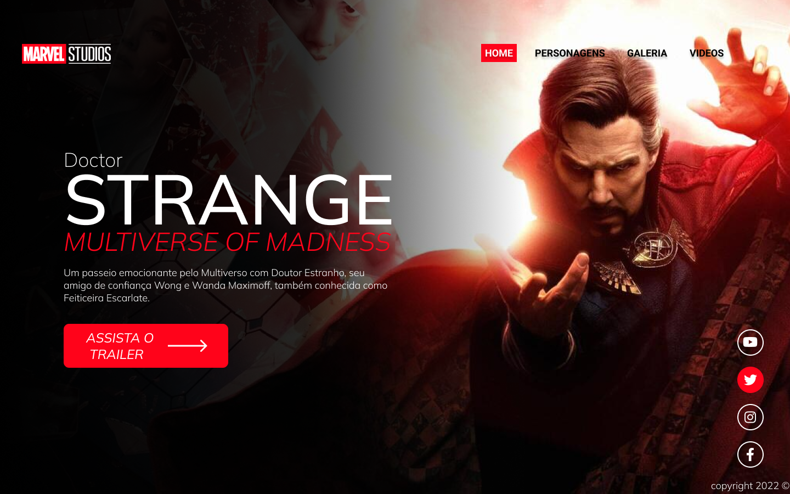
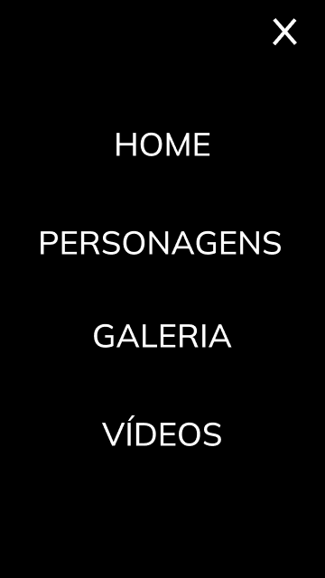
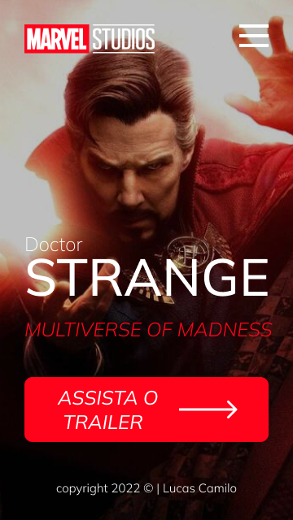

# Projeto doctor strange

## projeto feito na aula de lima no curso de Desenvolvimento de sistemas do [SENAI jandira](https://jandira.sp.senai.br/curso/85566/127/tecnico-de-desenvolvimento-de-sistemas), com o prof.[Fernando Leonid](https://github.com/fernandoleonid)

  

--- 
## Qual era o objetivo do projeto?
## o objetivo era criar um landing page com base no design feito no figma, aprendendo a estrutura do HTML, CSS, JS e conceitos de responsividade
---
## o que é landing pages?
## são paginas que tem o foco principal na conversão de visitantes, tendo uma estetica mais minimalistas comparada aos sites tradicionais

---
## tecnologias usadas

- HTML 5
- CSS 3
- JS
- Figma

---
## links
- [Resultado](https://luscamilo.github.io/doctor-strange/)
- [Projeto figma](https://www.figma.com/file/p6AqHSvQa45puMJISA51aV/LIMA-Doutor-Estranho?node-id=12%3A61)
- [Código](https://github.com/LusCamilo/doctor-strange)

## Autor 
[Lucas Camilo](https://github.com/LusCamilo)
